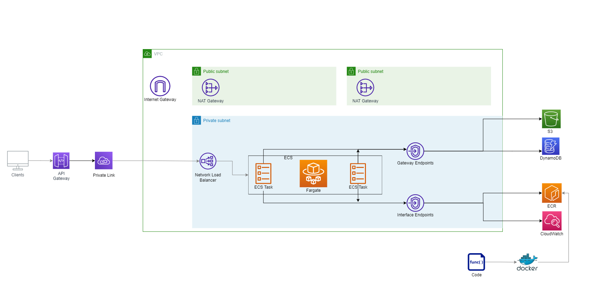

# AWS ECS Fargate and API Gateway IaC

An AWS infrastructure with multi-region/env/stage support for building scalable and performant microservices.



## Infrastructure State

`config` folder contains terraform configuration files for each specific stage and region. The config file can be adjusted based on need, e.g. different fargate CPU for each stage.

```
aws_region                   = "us-east-1"
aws_assume_role              = ""                              // Assume Role ARN that used to retrieve temporary security credentials
environment                  = "dev"
stage                        = "dev02"
app_image                    = ""                              // AWS ECR image URI
availability_zones           = ["us-east-1a", "us-east-1b"]    // Availability zones for VPC
acm_certificate_arn           = ""                             // AWS ACM certificate ARN that used for API custom domain mapping
hosted_zone_id               = ""                              // Route53 Hosted zone (Global for each AWS account)
```

## CI/CD Deployment

The code below shows an example of using Gitlab pipeline to deploy the service, but most fargate deployment will follow these steps:

1. Retrieve the infrastructure code remotely (optional if the infra code and the service are in the same repo)
2. Apply to terraform changes to AWS (In Gitlab, the state file is located under `Infrastructure > Terraform`)
3. Retrieve AWS credentials using assume role 
4. Login to Docker 
5. Build the docker image and deploy to ECR 
6. Force a new deployment to ECS to fetch the latest ECR image

```yaml
.deploy:
  variables:
    TF_VARS_PATH: "../config/dev/dev02/us-east-1-dev02.tfvars"      # The path that contains to terraform state file
    ACCOUNT_NUMBER: "123456789"                                           # AWS account number
    DEPLOYMENT_ROLE_NAME: "OrganizationAccountAccessRole"                 # The IAM role used to retrieve AWS session tokens
    REGION: "us-east-1"
    STAGE: "dev02"
    DOCKER_REGISTRY: "$ACCOUNT_NUMBER.dkr.ecr.$REGION.amazonaws.com"      # AWS ECR
    APP_NAME: appname-$STAGE-image                                        # Docker image name
    ECS_CLUSTER_NAME: appname-ecs-cluster-$STAGE                          # ECS cluster name
    ECS_SERVICE_NAME: appname-ecs-service-$STAGE                          # ECS service name
  script:
    # terraform init
    - gitlab-terraform init -var-file=${TF_VARS_PATH}
    - gitlab-terraform validate

    # terraform plan
    - gitlab-terraform plan -var-file=${TF_VARS_PATH} -var CI_PROJECT_DIR=${CI_PROJECT_DIR}
    - gitlab-terraform plan-json -var-file=${TF_VARS_PATH} -var CI_PROJECT_DIR=${CI_PROJECT_DIR}

    # terraform apply
    - terraform apply -auto-approve -var-file=${TF_VARS_PATH} -var CI_PROJECT_DIR=${CI_PROJECT_DIR}

    # configure AWS for the current region
    - export DEPLOYMENT_ROLE=arn:aws:iam::${ACCOUNT_NUMBER}:role/${DEPLOYMENT_ROLE_NAME}
    - export AWS_DEFAULT_REGION=${REGION}
    - export $(printf "AWS_ACCESS_KEY_ID=%s AWS_SECRET_ACCESS_KEY=%s AWS_SESSION_TOKEN=%s" $(aws sts assume-role --role-arn ${DEPLOYMENT_ROLE} --role-session-name TemporaryServiceDeployment --query "Credentials.[AccessKeyId,SecretAccessKey,SessionToken]" --output text))
    - aws sts get-caller-identity
    - aws ecr get-login-password --region $REGION | docker login --username AWS --password-stdin $DOCKER_REGISTRY

    # move to root directory (depends on the project folder structure, navigate to the folder that contains Dockerfile)
    - cd ../../

    # build docker image and push to ECR
    - docker build -t $APP_NAME .
    - docker tag $APP_NAME:latest $DOCKER_REGISTRY/$APP_NAME:latest
    - docker push $DOCKER_REGISTRY/$APP_NAME:latest

    # create a new deployment for the ECS task
    - aws ecs update-service --cluster $ECS_CLUSTER_NAME --service $ECS_SERVICE_NAME --force-new-deployment --region ${REGION}
```
